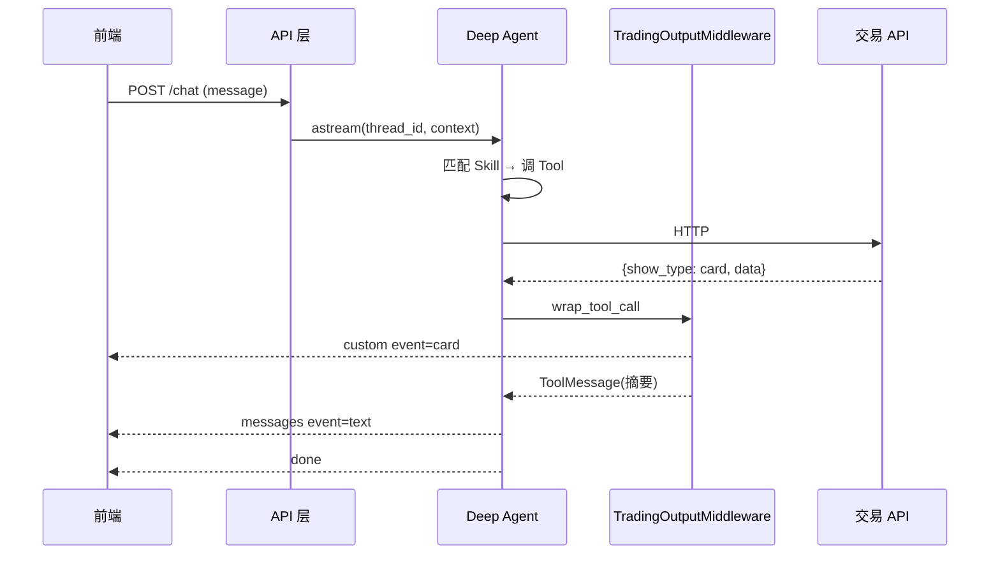

# 交易助手 Deep Agents 重构实施文档

> 基于 Deep Agents SDK 的用户交易助手架构方案  
> 目标：User/Conversation 隔离 + 三种输出（text / card / popup）

---

## 1. 背景与目标

### 1.1 业务需求

| 需求 | 说明 |
|------|------|
| User 隔离 | 不同用户加载不同的 Skill、MCP |
| Conversation 隔离 | 同一会话加载完整对话上下文 |
| 输出类型 1：Text | 普通文字，介绍交易项目等 |
| 输出类型 2：Card | 业务 Skill 触发 API，`show_type=card` 时包装为卡片 JSON 流式返回 |
| 输出类型 3：Popup | 用户意图模糊时生成选项，用户点击后继续（`event=popup`） |

### 1.2 技术选型结论

- **Agent 运行时**：Deep Agents（`create_deep_agent`）
- **对话持久化**：LangGraph Checkpointer + `thread_id`
- **用户数据隔离**：`context_schema` + `StoreBackend` namespace
- **Card/Popup**：自定义 Middleware + `stream_writer` + LangGraph `interrupt`
- **MCP**：应用层加载（参考 `deepagents-code/mcp_tools.py`），非 SDK 内置

---

## 2. 总体架构

### 2.1 分层架构

```
┌─────────────────────────────────────────────────────────────┐
│  API 网关层（FastAPI / 现有服务）                              │
│  - JWT/Session 鉴权 → user_id                                │
│  - conversation_id → thread_id                               │
│  - SSE/WebSocket 流式适配（统一 event 协议）                  │
│  - Popup resume 接口（Command(resume=...)）                   │
└───────────────────────────┬─────────────────────────────────┘
                            │
┌───────────────────────────▼─────────────────────────────────┐
│  Deep Agent 层（全局 compile 一次，请求级 context）            │
│  create_deep_agent + 自定义 Middleware 栈                     │
└───────────────────────────┬─────────────────────────────────┘
                            │
┌───────────────────────────▼─────────────────────────────────┐
│  存储层                                                       │
│  - Checkpointer（Postgres）：对话 state                       │
│  - Store / 对象存储 / DB：用户 Skill 文件                     │
│  - 配置中心：用户 MCP 配置                                    │
└─────────────────────────────────────────────────────────────┘
```

### 2.2 核心设计原则

1. **单 Agent 实例复用**：不按用户 compile 多个 agent，用 `context` + backend 路由隔离。
2. **Card/Popup 由代码决定**：不让 LLM 组装 card JSON；在 tool/middleware 层根据 API `show_type` 路由。
3. **Skill 管流程，Tool 管执行**：SKILL.md 写「何时、怎么调」；API 封装在 `@tool` 里。
4. **流式协议与 LangGraph 解耦**：对外统一 `{event, data}`，内部消费 `messages` / `custom` / `updates`。

---

## 3. 隔离方案

### 3.1 Conversation 隔离（对话上下文）

**机制**：LangGraph Checkpointer + `configurable.thread_id`

```python
config = {"configurable": {"thread_id": conversation_id}}

# 首轮
await agent.ainvoke(
    {"messages": [HumanMessage(content=user_message)]},
    config=config,
    context=trading_context,
)

# 后续轮次：同一 conversation_id，messages 从 checkpoint 恢复
await agent.ainvoke(
    {"messages": [HumanMessage(content=next_message)]},
    config=config,
    context=trading_context,
)
```

| 项目 | 建议 |
|------|------|
| Checkpointer | 生产用 **Postgres**（LangGraph 官方支持） |
| thread_id | 等于业务 `conversation_id`（UUID） |
| 持久字段 | `messages`、`todos`（可选）、`files`（StateBackend 时） |
| Summarization | 长对话自动压缩，历史 offload 到 backend |

### 3.2 User 隔离（Skill / MCP）

**机制**：`context_schema` 传入 `user_id`，backend / middleware 按用户路由。

#### 3.2.1 Context 定义

```python
from typing import TypedDict

class TradingContext(TypedDict, total=False):
    user_id: str
    conversation_id: str
    enabled_skills: list[str] | None   # 可选：白名单
    mcp_server_ids: list[str] | None   # 可选：该用户启用的 MCP
    tenant_id: str | None              # 可选：多租户
```

每次请求传入：

```python
context: TradingContext = {
    "user_id": current_user.id,
    "conversation_id": conversation_id,
    "mcp_server_ids": load_user_mcp_config(current_user.id),
}
```

#### 3.2.2 Skill 按用户隔离

**推荐**：`StoreBackend` + namespace factory

```
存储布局（逻辑路径）：
/skills/base/                    → 全局公共 Skill（所有用户）
/skills/user/                    → 用户专属 Skill（backend 路由到 user namespace）
```

```python
from deepagents.backends import CompositeBackend, StoreBackend, StateBackend

def create_backend(runtime):
    user_id = runtime.context["user_id"]
    return CompositeBackend(
        default=StateBackend(),  # 会话内临时文件
        routes={
            "/skills/user/": StoreBackend(
                store=store,
                namespace=lambda rt: (rt.context["user_id"], "skills"),
            ),
        },
    )

agent = create_deep_agent(
    backend=create_backend,
    skills=["/skills/base/", "/skills/user/"],
    context_schema=TradingContext,
    ...
)
```

**注意**：`SkillsMiddleware.before_agent` 在 state 已有 `skills_metadata` 时会跳过加载。换用户或换 skill 配置时，需在新 thread 启动，或在自定义 middleware 里按 `user_id` 强制刷新 metadata。

#### 3.2.3 MCP 按用户隔离

SDK 不内置 MCP；参考 `libs/code/deepagents_code/mcp_tools.py`。

**推荐流程**：

```
1. 请求进入 → 根据 user_id 读 MCP 配置（DB/配置中心）
2. resolve_and_load_mcp_tools(user_mcp_config) → BaseTool 列表
3. UserMCPMiddleware.wrap_model_call → 按 context 动态 bind 该用户的 MCP tools
4. 请求结束 → cleanup MCP session（AsyncExitStack）
```

| 方案 | 适用 |
|------|------|
| 请求级加载 MCP tools | Web 服务（推荐） |
| 每用户长连接池 | 高 QPS、MCP 连接开销大 |
| MCP 包装成内部 HTTP tool | 简化连接管理，牺牲 MCP 动态性 |

---

## 4. 三种输出形态

### 4.1 对外流式协议（SSE）

统一格式，前端只认 `event`：

```json
{"event": "text",  "data": {"content": "..."}}
{"event": "tool",  "data": {"content": "...", "tool_call_id": "..."}}
{"event": "card",  "data": { /* 业务 API data */ }}
{"event": "popup", "data": {
  "title": "请确认交易类型",
  "options": [{"id": "spot", "label": "现货"}, {"id": "futures", "label": "合约"}],
  "tool_call_id": "call_xxx"
}}
{"event": "done",  "data": {}}
{"event": "error", "data": {"message": "..."}}
```

> **2026-07 更新**：新增 `event=tool`，输出工具调用过程（开发调试阶段暴露中间流程）。使用 `stream_mode=["messages", "updates"]`。

### 4.2 类型 1：Text（普通文字）

**来源**：LLM `AIMessage` 流式 token  
**实现**：`stream_mode=["messages"]`，适配器提取 `content` → `event=text`

**适用**：项目介绍、概念解释、无结构化 UI 的回复。

### 4.3 类型 2：Card（业务卡片）

**触发**：业务 Skill → Tool 调交易 API → 响应含 `show_type: "card"`

**流程**：

```
User 提问
  → Agent 匹配 Skill（read_file SKILL.md）
  → LLM 调用业务 @tool
  → Tool 请求交易 API
  → API 返回 { show_type: "card", data: {...} }
  → TradingOutputMiddleware 识别 show_type
  → stream_writer({ event: "card", data: api_data })
  → ToolMessage 给 LLM 写简短摘要（不把大 JSON 塞进 context）
  → 前端收到 event=card 渲染卡片
```

**实现要点**：

```python
class TradingOutputMiddleware(AgentMiddleware):
    def wrap_tool_call(self, request, handler):
        result = handler(request)
        api_response = parse_tool_result(result)  # 从 ToolMessage 或结构化返回值解析

        if api_response.get("show_type") == "card":
            writer = getattr(request.runtime, "stream_writer", None)
            if writer:
                writer({"event": "card", "data": api_response["data"]})
            return ToolMessage(
                content="已向用户展示相关卡片。",
                tool_call_id=request.tool_call["id"],
            )
        return result
```

**消费流**：

```python
async for chunk in agent.astream(
    input_data,
    config=config,
    context=context,
    stream_mode=["messages", "custom"],
):
    namespace, mode, data = chunk
    if mode == "custom" and isinstance(data, dict):
        if data.get("event") == "card":
            yield sse("card", data["data"])
    elif mode == "messages":
        # 提取 AIMessage token → event=text
        ...
```

### 4.4 类型 3：Popup（确认弹窗）

**触发**：意图模糊，需用户点选（交易类型、币种、方向等）

**与 Card 的区别**：需要 **暂停 Agent**，等用户选择后 **resume**。

**参考**：`libs/code/deepagents_code/ask_user.py` 的 `interrupt()` 模式。

**流程**：

```
LLM 调用 confirm_popup tool
  → stream_writer({ event: "popup", data: {...} })  // 推前端
  → interrupt({ type: "popup", options, tool_call_id })  // 暂停 graph
  → API 返回 __interrupt__，HTTP 可结束
  → 用户点击选项
  → 新请求：agent.invoke(Command(resume={"selected": "spot"}), config=同 thread_id)
  → ToolMessage("用户选择了: 现货") 写回 state
  → Agent 继续执行
```

**Tool 骨架**：

```python
from langgraph.types import Command, interrupt
from langchain.tools import InjectedToolCallId

@tool
def confirm_popup(
    title: str,
    options: list[dict],  # [{"id": "...", "label": "..."}]
    tool_call_id: Annotated[str, InjectedToolCallId],
) -> Command:
    payload = {
        "event": "popup",
        "data": {"title": title, "options": options, "tool_call_id": tool_call_id},
    }
    # runtime.stream_writer(payload)  // 在 middleware 或 tool 内
    user_response = interrupt({"type": "popup", "options": options})
    selected = user_response.get("selected")
    return Command(update={
        "messages": [ToolMessage(f"用户选择了: {selected}", tool_call_id=tool_call_id)]
    })
```

**Resume API**：

```python
# POST /conversations/{id}/resume
await agent.ainvoke(
    Command(resume={"selected": request.body.option_id}),
    config={"configurable": {"thread_id": conversation_id}},
    context=trading_context,
)
```

**要求**：必须使用 **持久化 Checkpointer**；`thread_id` 与发起 popup 的会话一致。

### 4.5 输出类型对照表

| 类型 | event | 是否暂停 Agent | 实现层 | LLM 职责 |
|------|-------|----------------|--------|----------|
| Text | `text` | 否 | messages stream | 生成文案 |
| Card | `card` | 否 | `wrap_tool_call` + `stream_writer` | 选 skill、调 tool |
| Popup | `popup` | 是（interrupt） | `confirm_popup` tool + resume | 生成选项、决定何时澄清 |

---

## 5. Agent 组装方案

### 5.1 create_deep_agent 配置

```python
from deepagents import create_deep_agent

agent = create_deep_agent(
    model="anthropic:claude-sonnet-4-6",  # 或你的模型
    system_prompt=TRADING_ORCHESTRATOR_PROMPT,
    tools=[
        *trading_api_tools,      # 封装交易 API 的 @tool
        # confirm_popup 由 ConfirmPopupMiddleware 注入
    ],
    skills=["/skills/base/", "/skills/user/"],
    backend=create_user_scoped_backend,
    context_schema=TradingContext,
    checkpointer=postgres_checkpointer,
    middleware=[
        UserMCPMiddleware(),           # 按 user 注入 MCP tools
        TradingOutputMiddleware(),     # card 拦截 + stream_writer
        ConfirmPopupMiddleware(),      # popup tool + interrupt
        # 可选：去掉 execute 等不需要的能力
    ],
    subagents=[
        {
            "name": "market-analyst",
            "description": "行情分析、资讯检索，一次只处理一个主题",
            "system_prompt": MARKET_ANALYST_PROMPT,
            "tools": [market_search_tool],
        },
    ],
)
```

### 5.2 System Prompt 分工

| 内容 | 来源 | 说明 |
|------|------|------|
| 角色、合规、话术边界 | `TRADING_ORCHESTRATOR_PROMPT` | 开发者模板 |
| 何时用 popup 澄清 | prompt + `confirm_popup` tool description | 模糊意图必须澄清 |
| 业务流程 | 各业务 `SKILL.md` | 人类编写，渐进披露 |
| API 字段、show_type | OpenAPI / 代码 | **不给 LLM 拼 card** |

### 5.3 Skill 目录规范

```
/skills/base/order-guide/
  SKILL.md          # YAML frontmatter + 下单流程说明
  api.yaml          # 可选：API 映射、show_type 说明（给开发看，不给模型拼 JSON）

/users/{user_id}/skills/custom-strategy/   # StoreBackend 映射到 /skills/user/
  SKILL.md
```

SKILL.md frontmatter 示例：

```yaml
---
name: spot-order
description: 现货下单、查持仓、查订单。用户提到买卖、持仓、订单时使用。
allowed_tools:
  - query_positions
  - place_spot_order
  - confirm_popup
---
```

### 5.4 业务 Tool 返回约定（已重构）

> **2026-07 重构**：Phase 3 采用通用 API 执行方案，详见 [§5.5](#55-通用-api-执行方案新)。

所有业务 tool 统一返回：

```python
@dataclass
class TradingToolResult:
    show_type: Literal["text", "card", "none"]
    data: dict | None          # show_type=card 时的卡片数据
    summary: str               # 给 LLM 的 ToolMessage 摘要
```

Middleware 只认这个结构，不解析自然语言。

### 5.5 通用 API 执行方案（新）

**设计原则**：业务方通过 Skill 文件自助接入，系统只有一个通用 tool：`call_internal_api`。

#### Skill 目录结构

```
skills/base/<业务名>/
  ├── SKILL.md       # 业务描述、SOP、意图识别
  └── apis.yaml      # API schema 定义
```

#### apis.yaml 格式

```yaml
apis:
  - name: query_gift_card        # tool 调用的 api_name
    description: 查询礼品卡余额
    path: /api/v1/gift-card/query
    method: POST
    show_type: card              # card | text | none
    params:
      - name: card_no
        type: string
        required: true
```

#### 数据流

```
用户输入 → Agent 匹配 Skill → LLM 调 call_internal_api(api_name, params)
  → 加载 apis.yaml 查找 schema → 校验参数
  → HTTP 请求内部 API → 解析 {code, message, data}
  → code=0 + show_type=card → TradingMiddleware → stream_writer event=card
  → code=0 + show_type=text → data 给 LLM 继续对话
  → code≠0 → 错误信息给 LLM
```

#### 新业务接入

1. 创建 `skills/base/<业务名>/SKILL.md`
2. 创建 `skills/base/<业务名>/apis.yaml`
3. 内部 API 按 `{code, message, data}` 格式响应
4. 无需改代码、无需重新部署

---

## 6. 开发环境

### 6.0 服务架构

开发阶段使用双服务架构：

```
./start.sh
  ├── uvicorn src.mock_server:app --port 9000   (Mock 内部 API)
  └── uvicorn src.api:app --port 8000           (Agent 主服务)
```

| 服务 | 端口 | 说明 |
|------|------|------|
| Agent 主服务 | 8000 | FastAPI，SSE 流式对话 + 会话/Skill CRUD |
| Mock 内部 API | 9000 | FastAPI，模拟业务后端（礼品卡、交易、行情） |

Mock API 返回格式：`{code: 0, message: "ok", data: {...}}`。`code=0` 成功，`code≠0` 失败。切换生产环境只需修改 `MOCK_API_URL` 环境变量指向真实地址。

## 7. 请求生命周期

### 7.1 正常对话（Text + Card）

```
1. POST /chat/stream
   Body: { conversation_id, message }
   Header: Authorization → user_id

2. 鉴权 → 构造 TradingContext

3. agent.astream(
     {"messages": [HumanMessage(content=message)]},
     config={"configurable": {"thread_id": conversation_id}},
     context=context,
     stream_mode=["messages", "updates", "custom"],
   )

4. 流适配器转发：
   - messages (AIMessage chunks)     → event=text
   - custom (card)                 → event=card
   - 无 tool_calls 的 AIMessage 结束 → event=done
```

### 6.2 Popup 中断与恢复

```
1. Agent 调用 confirm_popup
2. 流中出现 event=popup + updates.__interrupt__
3. 前端渲染弹窗，关闭 SSE 或保持连接（按产品设计）
4. 用户选择 → POST /conversations/{id}/resume
   Body: { option_id: "spot" }
5. agent.ainvoke(Command(resume={"selected": "spot"}), 同 config/context)
6. Agent 继续 → 可能再出 card 或 text → event=done
```

### 6.3 时序图



---

## 7. 自定义 Middleware 清单

| Middleware | 职责 | 关键 Hook |
|------------|------|-----------|
| `UserMCPMiddleware` | 按 `context.user_id` 加载/绑定 MCP tools | `wrap_model_call` |
| `TradingOutputMiddleware` | 识别 `show_type=card`，发 custom 事件，缩短 ToolMessage | `wrap_tool_call` |
| `ConfirmPopupMiddleware` | 注入 `confirm_popup` tool，处理 interrupt | `tools` + `@tool` 内 `interrupt()` |
| `UserSkillsRefreshMiddleware`（可选） | 用户切换时刷新 `skills_metadata` | `before_agent` |

---

## 8. 实施阶段（建议顺序）

### Phase 1：基础对话

- [ ] `create_deep_agent` + Postgres Checkpointer
- [ ] `TradingContext` + `thread_id = conversation_id`
- [ ] SSE 适配：`messages` → `event=text`
- [ ] 基础 system prompt（交易助手角色）

**验收**：多轮对话、跨请求上下文保持、流式 text 输出。

### Phase 2：User Skill 隔离

- [ ] `StoreBackend` + user namespace
- [ ] `/skills/base/` + `/skills/user/` 目录与上传接口
- [ ] 验证不同 user_id 看到不同 Skill 列表

**验收**：用户 A/B 加载不同 SKILL.md，Agent 行为不同。

### Phase 3：Card 输出

- [ ] 交易 API 封装为 `@tool`，统一 `TradingToolResult`
- [ ] `TradingOutputMiddleware` + `stream_mode=["custom"]`
- [ ] 前端 card 组件对接 `event=card`
- [ ] 2–3 个业务 Skill（查持仓、查订单等）

**验收**：触发业务 Skill 时前端收到 card，LLM context 不含大 JSON。

### Phase 4：Popup 澄清

- [ ] `confirm_popup` tool + `interrupt`
- [ ] Resume API + 前端点选回调
- [ ] Prompt 规则：模糊意图必须 popup，禁止猜测

**验收**：模糊问题弹出选项，选择后会话继续且 state 正确。

### Phase 5：MCP 按用户

- [ ] 用户 MCP 配置 CRUD
- [ ] `UserMCPMiddleware` 请求级加载
- [ ] 连接池 / cleanup 与监控

**验收**：不同用户可用不同 MCP 工具，无连接泄漏。

### Phase 6：生产加固

- [ ] Summarization（长对话）
- [ ] 权限与合规（HITL 敏感操作）
- [ ] Tracing（LangSmith）
- [ ] 限流、超时、错误降级

---

## 9. API 接口草案

| 方法 | 路径 | 说明 |
|------|------|------|
| POST | `/conversations` | 创建会话，返回 `conversation_id` |
| POST | `/conversations/{id}/chat/stream` | SSE 流式对话 |
| POST | `/conversations/{id}/resume` | Popup 选择后恢复 Agent |
| GET | `/conversations/{id}/history` | 历史消息（可选，或只靠 checkpoint） |
| CRUD | `/users/me/skills` | 用户 Skill 管理 |
| CRUD | `/users/me/mcp` | 用户 MCP 配置 |

---

## 10. 风险与规避

| 风险 | 规避 |
|------|------|
| LLM 拼 card JSON | 只在 middleware 发 `event=card` |
| ToolMessage 过大 | 只写 `summary`，原始 data 走 custom stream |
| 换用户 skill 不刷新 | 新 thread 或 `UserSkillsRefreshMiddleware` |
| Popup 无法 resume | 必须持久化 Checkpointer + 同 thread_id |
| MCP 连接泄漏 | 请求级 `AsyncExitStack.cleanup()` |
| 多用户共用一个 agent 实例 | 所有 user 数据走 context/backend，禁止全局可变状态 |
| interrupt 被 middleware 吞掉 | `wrap_tool_call` 勿 catch `GraphInterrupt` |

---

## 11. 与 Deep Agents 能力映射

| 你的需求 | Deep Agents 能力 | 自研部分 |
|----------|------------------|----------|
| 多轮对话 | Checkpointer + thread_id | Postgres 部署 |
| User Skill | SkillsMiddleware + StoreBackend | namespace 路由 |
| User MCP | — | UserMCPMiddleware |
| Text 流式 | messages stream | SSE 适配器 |
| Card | stream_writer（参考 RubricMiddleware） | TradingOutputMiddleware |
| Popup | interrupt（参考 AskUserMiddleware） | confirm_popup + resume API |
| 任务完成 | 无 tool_calls 即结束 | Popup 中间态处理 |

---

## 12. 参考代码位置（本仓库）

| 主题 | 路径 |
|------|------|
| Agent 入口 | `libs/deepagents/deepagents/graph.py` |
| Skills 加载 | `libs/deepagents/deepagents/middleware/skills.py` |
| SubAgent / task | `libs/deepagents/deepagents/middleware/subagents.py` |
| custom stream | `libs/deepagents/deepagents/middleware/rubric.py` |
| Popup / interrupt | `libs/code/deepagents_code/ask_user.py` |
| MCP 加载 | `libs/code/deepagents_code/mcp_tools.py` |
| Context 模式 | `libs/code/deepagents_code/_cli_context.py` |
| 多租户 Backend | `libs/deepagents/deepagents/backends/store.py` |
| Demo 参考 | `examples/deep_research/agent.py` |

---

## 13. 最小可运行伪代码（串联）

```python
# --- 构建（启动时一次）---
agent = create_deep_agent(
    model=model,
    system_prompt=TRADING_ORCHESTRATOR_PROMPT,
    tools=trading_tools,
    skills=["/skills/base/", "/skills/user/"],
    backend=create_user_scoped_backend,
    context_schema=TradingContext,
    checkpointer=postgres_checkpointer,
    middleware=[UserMCPMiddleware(), TradingOutputMiddleware(), ConfirmPopupMiddleware()],
)

# --- 流式对话 ---
async def chat_stream(user_id: str, conversation_id: str, message: str):
    context = {"user_id": user_id, "conversation_id": conversation_id}
    config = {"configurable": {"thread_id": conversation_id}}

    async for ns, mode, data in agent.astream(
        {"messages": [HumanMessage(content=message)]},
        config=config,
        context=context,
        stream_mode=["messages", "updates", "custom"],
    ):
        if mode == "custom" and data.get("event") in ("card", "popup"):
            yield {"event": data["event"], "data": data["data"]}
        elif mode == "messages":
            msg, _ = data
            if isinstance(msg, AIMessage) and msg.content:
                yield {"event": "text", "data": {"content": msg.content}}
        elif mode == "updates" and "__interrupt__" in data:
            yield {"event": "interrupt", "data": data["__interrupt__"]}

    yield {"event": "done", "data": {}}

# --- Popup 恢复 ---
async def resume_popup(user_id: str, conversation_id: str, selected: str):
    await agent.ainvoke(
        Command(resume={"selected": selected}),
        config={"configurable": {"thread_id": conversation_id}},
        context={"user_id": user_id, "conversation_id": conversation_id},
    )
```

---

## 14. 文档维护

- **版本**：v1.0  
- **适用 SDK**：deepagents（LangGraph + LangChain agents）  
- **后续迭代**：SubAgent 拆分（行情分析 / 下单执行）、HITL 大额交易确认、结构化 `response_format` 等

---

如需把本文档落到仓库（例如 `docs/trading-agent-implementation.md`）或展开某一 Phase 的接口/OpenAPI 设计，可切换到 Agent 模式说明目标路径。